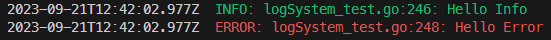

# GoLang customizatble logging system

Logging library for golang, customizable with custom logging level and targets.


## Install

``` bash
go get github.com/Convez/go-logging
```

## Usage
Use the logSystemBuilder to build your logSystem.
The following builder example uses all available features for the library:
```golang
dest1 := new(bytes.Buffer)
dest2 := new(bytes.Buffer)
builder := gologging.NewLogSystemBuilder().
    WithDestination(dest1). // Overwrite the default destination (STDOUT)
    WithAdditionalDestination(dest2). // Add a new destination (*io.Writer)
    WithAdditionalLevelAbove("CUSTOM1", "INFO"). // Create a new custom log level with higher severity than INFO
    WithAdditionalLevelBelow("CUSTOM2", "INFO"). // Create a new custom log level with lower severity than INFO
    WithTimestampFormat("yyyy-MM-dd*HH:mm:ss"). // Changes the timestamp format
    WithFileNameEnabled(false).  // Removes file name from log line
    WithSeverityEnabled(false).  // Remove severity from log line
    WithTimestampEnabled(false).  // Removes the timestamp from log line
    WithColorEnabled(false)      // Removes colors from line messages

logSystem := builder.Build()
```
Default logging levels available in the library:

    ERROR
    WARN 
    INFO 
    DEBUG
    TRACE


Once the logging system is build, a logger for the desired logging level can be retrieved:

```golang
// Logger for standard INFO severity
infoLogger := logSystem.GetLogger(gologging.INFO)
infoLogger.println("Printing info log")
// Logger for custom CUSTOM1 severity
custom1Logger := logSystem.GetLogger("CUSTOM1")
custom1Logger.println("Printing custom log severity")
```

The shown severity level can be updated via the CONVEZ_LOG_LEVEL environment variable.
Custom log severity levels can be used. It defaults to INFO if the requested shown level does not exist.

Default settings:

    destinations:  []io.Writer{os.Stdout},
    timeFormat:    "2006-01-02T15:04:05.999Z",
    showTimeStamp: true,
    logLevels:     []string{ERROR, WARN, INFO, DEBUG, TRACE},
    showFileName:  true,
    showSeverity:  true,

## Colors
Colors are enabled by default for the logs.



Each severity level are associated by default to color:
    ERROR: RED
    WARN: YELLOW 
    INFO: GREEN 
    DEBUG: WHITE 
    TRACE: CYAN

The color associated to a severity level can be updated when building the logSystem:

```golang
builder = builder.WithSeverityColor(INFO, PURPLE)
```
Alternatively to the default available colors, an ANSI color escape sequence can be used:

```golang
builder = builder.WithSeverityColor(INFO, "\033[36m")
```

Default available colors:

	RESET (no color):   "\033[0m"
	RED:                "\033[31m"
	GREEN:              "\033[32m"
	YELLOW:             "\033[33m"
	BLUE:               "\033[34m"
	PURPLE:             "\033[35m"
	CYAN:               "\033[36m"
	GRAY:               "\033[37m"
	WHITE:              "\033[97m"